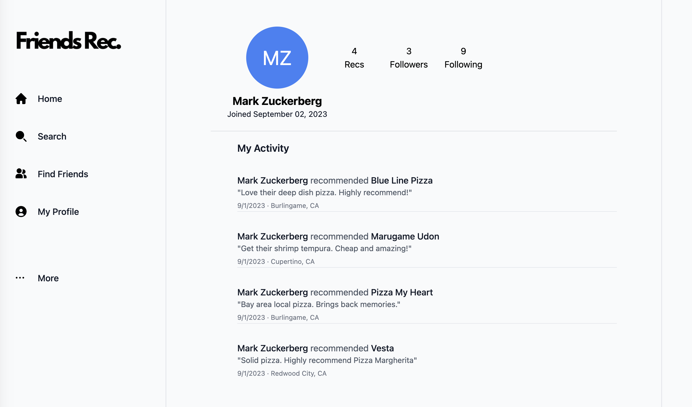
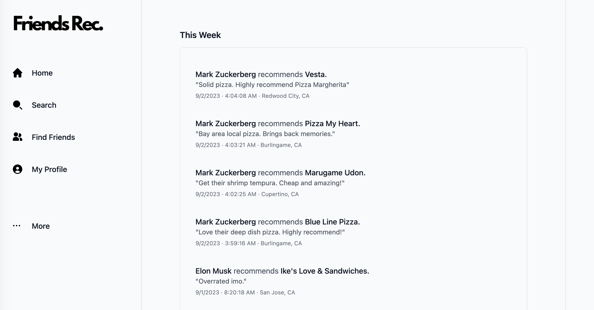
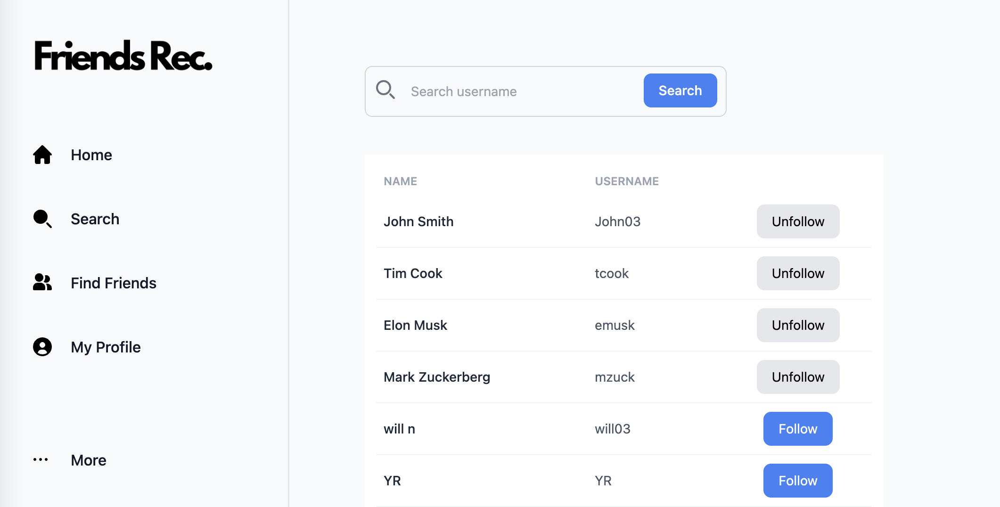

<p align="center">
  <h1 align="center"><b>Friends Rec</b></h1>
</p>
<h2 align="center">
  An application that leverages their personal social connections to provide restaurant recommendations.
</h2>
  
<!-- TABLE OF CONTENTS -->
<details open="open">
  <summary>Table of Contents</summary>
  <ol>
    <li><a href="#overview">Overview</a></li>
    <li><a href="#installation--getting-started">Installation / Getting Started</a></li>
    <li><a href="#functionality">Functionality / Features</a></li>
    <li><a href="#tech-stack">Tech Stack</a></li>
    <li><a href="#contributing">Contributing</a></li>
    <li><a href="#meet-our-team">Meet our Team</a></li>
  </ol>
</details>

## <b>Overview</b>

<p align="left">
FriendsRec is a social platform that leverages the user's friends connections to provide restaurant recommendations. This allows the user to trust the recommendations, making dining choices more personable and reliable. This application promotes social interactions and aids users to discover new dining options that are personally vetted.
</p>

## <b>Installation / Getting Started</b>

Please perform the following steps to install:

1. Clone the FriendsRec repository onto the user's local machine.
2. Open FriendsRec repo in Visual Studio Code.
3. Run the following command in the terminal. This will npm install node modules in the root, client, and server folders:

```
npm run dependency
```

4. Run `npm run dev` in the root directory.
5. Run `http://localhost:3000/` on your browser to start sharing your recommendations with your friends!

## <b>Functionality / Features</b>

### User Authentication and Profiles

Users can create accounts and log in securely. A profile is created with their name, profile photo, joined date, and a list of their own recommendations.


### Restaurant Recommendations

Users can search and recommend a restaurant to share with their social connections. The users can also filter to view your and your friends recommendations on the map.

### Newsfeed

Users can view restaurant recommendations made by their friends, which includes details to the restaurant's name, location, and a brief comment from the friend who made the recommendation.


### Friends

Users can connect with their friends on the platform, which allows users to see the recommendations in their feed.


## <b>Tech Stack</b>

- [TypeScript](https://www.typescriptlang.org/)
- [JavaScript](https://www.javascript.com/)
- [React](https://react.dev/)
- [Webpack](https://webpack.js.org/)
- [Tailwind CSS](https://tailwindui.com/)
- [PostgreSQL](https://www.postgresql.org/)
- [Node.js](https://nodejs.org)
- [Express](https://expressjs.com/)

## <b>Contributing</b>

As part of the open source community, we'd like to welcome those who'd like to contribute to this product. We released FriendsRec in hopes of helping developers efficiently onboard new codebases. If you found this project useful, feel free to give it a star to help increase the visibility of this product. If you found any issues with this product, please report them with the 'Issues' tab or submit a PR.

Thank you!

  <p align="left">
      <a href="https://github.com/FriendsRecCollaborative/FriendsRec/issues">Report Bug / Request Feature</a>
  </p>

## <b>Meet Our Team</b>

- Andrew Larkin • [LinkedIn](https://www.linkedin.com/in/larkinaj/) • [Github](https://github.com/larkinaj)
- Kevin Yoon • [LinkedIn](https://www.linkedin.com/in/kevinjyoon/) • [Github](https://github.com/kyoon0)
- William Nguyen • [LinkedIn](https://www.linkedin.com/in/william-nguyen202103/) • [Github](https://github.com/wnguye03)
- Yourui Ruan • [LinkedIn](https://www.linkedin.com/in/youruir/) • [Github](https://github.com/YouruiR)
